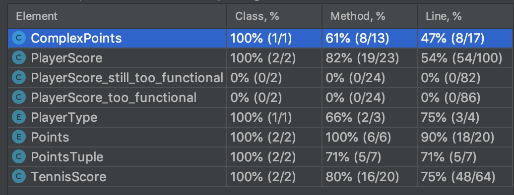

# Tennis score logic - Extremely Questionable [EQ] 

## Description

Write a program that can track the score of a tennis match:
- The main class should have three accessible methods playerAWonPoint(),
playerBWonPoint(), currentScore()
- currentScore() should return a String of the form
> &lt;player A sets&gt;/&lt;player B sets&gt; &lt;player A games&gt;/&lt;player B games&gt;
&lt;player A roundPoints&gt;/&lt;player B roundPoints&gt;_
- For example, &quot;2/1 3/2 AD/40&quot; indicating that A is 2 sets to 1 up, A is 3 games
to 2 up in the fourth set, and has Advantage in the current game
- Another example, &quot;2/1 6/6 5/3&quot; indicating that A is 2 sets to 1 up, it is 6 all in
the fourth set and player A is leading the tie break 5-3

- It should use the rules as per Wimbledon Men’s Singles, i.e. 5 sets and a tie-break if
12-12 is reached in the fifth set
> See https://en.wikipedia.org/wiki/Tennis_scoring_system for reference.

## Prerequisites and Solutions

- [x] Code: Java 8, Gradle
- [x] Application might be divided into sub apps (here domain model is presented only)
- [x] Functional tests: Spock, Groovy
- [x] Application architecture - simple structural due to complex logic and short time to implement 
- [x] Every modification is giving new object (kind of immutable) - this allows you to keep the history of the roundPoints
Each object might be forwarded to storage. 

## The pure functional approach

The functional approach is desired, but it has some disadvantages too. 
- it's hard to debug lambda functions 
- it's easy to make mistake 
- it's very hard to follow the logic of the code

At some point I decided to rewrite everything to structural constructions (v2,v3) - bug has magically fixed itself. 
Decided to focus more on logic and tests (TDD). In the next step, when I fully understood the domain logic, I've refactored the code to make it easier to read and extend.
Could go deeper into functional style, but as mentioned above I am not a fun of the over-engineering.

## Testing the logic

- use gradle: 

`./gradlew clean build`

#### Test coverage report (100%)

##### TODO:
- write more tests - cover corner cases for set roundPoints
- rewrite to functional structure - to have better comparison
- rewrite to Java 11
