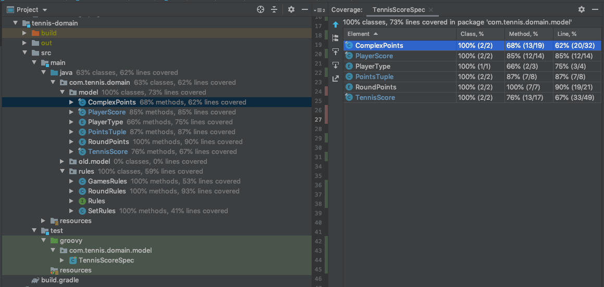

# Tennis score logic - Extremely Questionable [EQ] 

## Description

## Prerequisites and Solutions

- [x] Code: Java 8, Gradle
- [x] Application might be divided into sub apps (here domain model is presented only)
- [x] Functional tests: Spock, Groovy
- [x] Application architecture - simple structural due to complex logic and short time to implement 
- [x] Every modification is giving new object (kind of immutable) - this allows you to keep the history of the points
Each object might be forwarded to storage. 

## A few words from the author about functional approach

I know that functional approach is desired, but in Java it has some disadvantages. 
- it is hard to debug lambda functions 
- it is easy to make mistake 
- it is very hard to follow the logic of the code
- check PlayerScore_too_functional or PlayerScore_still_too_functional classes to check some functional cases

At some point I decided to rewrite everything to structural constructions - bug has magically fixed itself. 
Decided to focus more on logic and tests.

## Running application locally

- use gradle: ./gradlew clean build

#### Test coverage report (100%)

##### TODO:
- write more tests - cover corner cases for set points
- rewrite to functional structure - only when test coverage will be good enough 
- rewrite to Java 11